# Diagrama de componentes

- Estado: vigente
- ADR relacionados: [ADR-0001: plataforma y observabilidad](../adr/0001-monorepositorio-y-monolito-modular.md), [ADR-0002: identidad e invitaciones](../adr/0002-identidad-invitaciones-y-correo-transaccional.md), [ADR-0004: modularización backend](../adr/0004-arquitectura-modular-cqrs-y-limites-de-dependencia.md), [ADR-0005: modularización frontend](../adr/0005-frontend-modular-por-capacidades.md), [ADR-0006: campañas e invitaciones](../adr/0006-campanas-acceso-e-invitaciones.md) y [ADR-0007: imágenes privadas](../adr/0007-imagenes-privadas-de-personajes.md)
- Alcance: componentes lógicos de plataforma, identidad, campañas, invitaciones, personajes, bitácora, misiones y combates

Esta vista describe las responsabilidades y dependencias de la plataforma. No define todavía componentes de dominio ni incorpora información específica de ninguna campaña.

```mermaid
flowchart LR
    user["Usuario<br/>DM o jugador"]

    subgraph frontend["Frontend · Angular"]
        composition["Composition root<br/>config · routing"]
        shell["Shell y home<br/>composición por API pública"]
        shared["Shared<br/>runtime config · ProblemDetails"]
        subgraph platform_front["Módulo Platform"]
            status_ui["PlatformStatusComponent<br/>store de recorrido"]
            status_client["PlatformClient<br/>contrato HTTP"]
            status_ui --> status_client
        end
        subgraph access_front["Módulo Access"]
            access_ui["Login · bootstrap · aceptación<br/>invitaciones · usuarios elegibles"]
            session["SessionStore<br/>guards · interceptor bearer"]
            access_clients["IdentityClient · InvitationsClient<br/>contratos HTTP"]
            access_ui --> session
            access_ui --> access_clients
            session --> access_clients
        end
        subgraph campaigns_front["Módulo Campaigns"]
            campaigns_ui["Listado · creación · detalle"]
            campaigns_client["CampaignsClient<br/>contratos HTTP"]
            campaigns_ui --> campaigns_client
        end
        subgraph characters_front["Módulo Characters"]
            characters_ui["Elenco · alta · edición<br/>activación · eliminación"]
            characters_client["CharactersClient<br/>multipart · blobs autenticados"]
            characters_ui --> characters_client
        end
        subgraph journal_front["Módulo Journal"]
            journal_ui["Bitácora compartida<br/>alta · edición · eliminación · paginación"]
            journal_client["JournalClient<br/>contratos JSON"]
            journal_ui --> journal_client
        end
        subgraph missions_front["Módulo Missions"]
            missions_ui["Registro compartido<br/>alta · edición · estados · principal · borrado"]
            missions_client["MissionsClient<br/>contratos JSON sin fechas funcionales"]
            missions_ui --> missions_client
        end
        subgraph combat_front["Módulo Combat"]
            combat_ui["Encuentros de DM y jugador<br/>preparación · turnos · vida · sondeo"]
            combat_client["CombatClient<br/>contratos DM y proyección segura"]
            combat_ui --> combat_client
        end

        composition --> shell
        composition --> session
        shell -->|"API pública"| status_ui
        shell -->|"API pública"| access_ui
        shell -->|"API pública"| campaigns_ui
        shell -->|"API pública"| characters_ui
        shell -->|"ruta pública"| journal_ui
        shell -->|"ruta pública"| missions_ui
        shell -->|"ruta pública"| combat_ui
        status_client --> shared
        access_clients --> shared
        campaigns_client --> shared
        characters_client --> shared
        journal_client --> shared
        missions_client --> shared
        combat_client --> shared
    end

    subgraph edge["Entrada web"]
        nginx["Nginx<br/>estáticos y proxy same-origin"]
    end

    subgraph backend["Backend · ASP.NET Core"]
        middleware["Pipeline HTTP<br/>errores y correlación"]
        status_endpoint["Endpoint de estado<br/>/api/v1/platform/status"]
        health["Health checks<br/>/health/live · /health/ready"]
        host["Api Host<br/>composición · middleware"]
        subgraph access["Módulo Access · un proyecto"]
            identity_endpoints["Api<br/>contratos y endpoints"]
            application["Application<br/>commands · queries · puertos"]
            domain["Domain<br/>cuentas · sesiones · invitaciones · acceso"]
            access_contracts["Contracts públicos<br/>contexto DM · acceso jugador"]
            infrastructure["Infrastructure<br/>EF Core · auth · outbox · correo"]
            identity_endpoints --> application
            application --> domain
            application --> access_contracts
            infrastructure --> application
            infrastructure --> domain
            infrastructure --> access_contracts
        end
        subgraph campaigns["Módulo Campaigns · un proyecto"]
            campaigns_api["Api<br/>campañas"]
            campaigns_app["Application<br/>crear · listar · detalle"]
            campaigns_domain["Domain<br/>Campaign · DM único"]
            campaigns_contracts["Contracts públicos<br/>acceso efectivo a campaña"]
            campaigns_infra["Infrastructure<br/>EF Core · contratos Access"]
            campaigns_api --> campaigns_app
            campaigns_app --> campaigns_domain
            campaigns_app --> access_contracts
            campaigns_infra --> campaigns_app
            campaigns_infra --> campaigns_domain
            campaigns_infra --> access_contracts
            campaigns_infra --> campaigns_contracts
        end
        subgraph characters["Módulo Characters · un proyecto"]
            characters_api["Api<br/>CRUD · imagen · activo"]
            characters_app["Application<br/>autorización · casos de uso"]
            characters_domain["Domain<br/>PlayerCharacter"]
            characters_contracts["Contracts públicos<br/>instantánea para Combat"]
            characters_infra["Infrastructure<br/>EF Core · Azure Blob"]
            characters_api --> characters_app
            characters_app --> characters_domain
            characters_infra --> characters_app
            characters_infra --> characters_domain
            characters_infra --> characters_contracts
        end
        subgraph journal["Módulo Journal · un proyecto"]
            journal_api["Api<br/>entradas de bitácora"]
            journal_app["Application<br/>acceso · autoría · permisos"]
            journal_domain["Domain<br/>JournalEntry"]
            journal_infra["Infrastructure<br/>EF Core · cursor · métricas"]
            journal_api --> journal_app
            journal_app --> journal_domain
            journal_infra --> journal_app
            journal_infra --> journal_domain
        end
        subgraph missions["Módulo Missions · un proyecto"]
            missions_api["Api<br/>registro de misiones"]
            missions_app["Application<br/>acceso · autoría · permisos · principal"]
            missions_domain["Domain<br/>Mission · estados"]
            missions_infra["Infrastructure<br/>EF Core · concurrencia · métricas"]
            missions_api --> missions_app
            missions_app --> missions_domain
            missions_infra --> missions_app
            missions_infra --> missions_domain
        end
        subgraph combat["Módulo Combat · un proyecto"]
            combat_api["Api<br/>encuentros y proyección activa"]
            combat_app["Application<br/>acceso · preparación · dirección"]
            combat_domain["Domain<br/>Encounter · participantes · ciclo"]
            combat_infra["Infrastructure<br/>EF Core · concurrencia · métricas"]
            combat_api --> combat_app
            combat_app --> combat_domain
            combat_app --> campaigns_contracts
            combat_app --> characters_contracts
            combat_infra --> combat_app
            combat_infra --> combat_domain
        end
        telemetry["Instrumentación<br/>OpenTelemetry"]

        middleware --> host
        host --> identity_endpoints
        host --> campaigns_api
        host --> characters_api
        host --> journal_api
        host --> missions_api
        host --> combat_api
        middleware --> status_endpoint
        middleware --> health
        status_endpoint --> health
        middleware --> telemetry
        status_endpoint --> telemetry
        infrastructure --> telemetry
        campaigns_infra --> telemetry
        characters_infra --> telemetry
        journal_infra --> telemetry
        missions_infra --> telemetry
        combat_infra --> telemetry
    end

    database[("PostgreSQL")]
    postgres_exporter["PostgreSQL exporter"]
    alloy["Grafana Alloy<br/>scrape · OTLP HTTPS"]
    observability["Backend de observabilidad<br/>Collector · Prometheus · Tempo · Loki · Grafana"]
    brevo["Brevo<br/>API transaccional v3"]
    blob[("Azure Blob / Azurite<br/>contenedor privado")]

    user -->|"HTTP"| nginx
    nginx -->|"recursos estáticos"| frontend
    status_client -->|"GET /api/v1/platform/status"| nginx
    access_clients -->|"JSON · Authorization Bearer"| nginx
    campaigns_client -->|"JSON · Authorization Bearer"| nginx
    characters_client -->|"multipart y blobs · bearer"| nginx
    journal_client -->|"JSON · Authorization Bearer"| nginx
    missions_client -->|"JSON · Authorization Bearer"| nginx
    combat_client -->|"JSON · Authorization Bearer"| nginx
    nginx -->|"proxy /api y /health"| middleware
    infrastructure -->|"conexión SQL"| database
    campaigns_infra -->|"conexión SQL"| database
    characters_infra -->|"metadatos SQL"| database
    journal_infra -->|"entradas SQL"| database
    missions_infra -->|"misiones SQL"| database
    combat_infra -->|"encuentros SQL"| database
    characters_infra -->|"binarios privados"| blob
    database -->|"estadísticas operativas"| postgres_exporter
    observability -->|"scrape Prometheus local"| postgres_exporter
    postgres_exporter -->|"métricas :9187"| alloy
    alloy -->|"OTLP HTTPS en producción"| observability
    telemetry -->|"OTLP: logs, métricas y trazas"| observability
    infrastructure -->|"HTTPS · API key solo backend"| brevo
```

## Responsabilidades

| Componente | Responsabilidad | No debe asumir |
|---|---|---|
| Composition root y shell Angular | Configurar providers y routing; componer módulos mediante APIs públicas | Clientes HTTP, estado o detalles internos de módulos |
| Módulo frontend Platform | Consultar y presentar el estado técnico con estado limitado a la home | Sesión, identidad o reglas de Access |
| Módulo frontend Access | Login, sesión, bootstrap, invitaciones, guards, interceptor y contratos HTTP propios | Autoridad de seguridad o internals de módulos futuros |
| Módulo frontend Campaigns | Listar, crear y consultar campañas; navegar a la ruta pública de invitaciones | Usuarios, invitaciones o internals de Access |
| Módulo frontend Characters | Crear, listar, editar, activar y eliminar personajes; cargar imágenes autenticadas | Autorizar operaciones o acceder directamente al contenedor privado |
| Módulo frontend Journal | Listar, crear, editar y eliminar entradas según los permisos devueltos por la API | Decidir autoría, rol u ownership en el navegador |
| Módulo frontend Missions | Listar, crear y editar misiones; proyectar estados, principal y borrado autorizado | Introducir fechas funcionales o decidir autoría y permisos en el navegador |
| Módulo frontend Combat | Preparar y dirigir encuentros para el DM; observar únicamente la proyección activa segura para el jugador | Autorizar operaciones o inferir CA y vida ocultas desde datos de DM |
| Shared frontend | Runtime config y traducción genérica de `ProblemDetails` | Usuarios, sesiones, campañas, invitaciones o UI funcional |
| Nginx | Servir el build y mantener `/api` y `/health` bajo el mismo origen | Reglas de dominio |
| Api Host | Composición de módulos, middleware transversal, health y diagnóstico | Casos de uso, EF Core o contratos funcionales de Access |
| Módulo Access | Propiedad de cuentas, sesiones, invitaciones, búsqueda elegible y concesiones `Jugador` | Persistir campañas o consultar tablas de Campaigns |
| Módulo Campaigns | Propiedad de campañas, `DmUserId`, módulo opcional y consultas autorizadas | Persistir usuarios, invitaciones o concesiones de jugador |
| Módulo Characters | Propiedad de personajes, vínculo opcional, personaje activo y metadatos de imagen | Persistir usuarios/campañas o publicar blobs |
| Módulo Journal | Propiedad de entradas, autoría histórica, orden, paginación y permisos de escritura | Consultar tablas de Campaigns o Characters |
| Módulo Missions | Propiedad de misiones, autoría histórica, estados, borrado y principal única por campaña | Consultar tablas de Campaigns o Characters |
| Módulo Combat | Propiedad de encuentros, participantes, iniciativa, turnos, rondas, instantáneas y vida de enemigos | Consultar tablas ajenas o exponer CA y vida en la proyección de jugador |
| Dominio de invitaciones | Estados, caducidad de siete días y validación del token de un solo uso | Enviar correo o exponer el token persistido |
| Identidad y sesiones | Validar credenciales, emitir y revocar sesiones opacas | Permitir autorregistro o guardar tokens de sesión en claro |
| Worker de outbox | Entregar invitaciones con reintentos y eliminar el ciphertext tras procesarlo | Conceder permisos o registrar destinatarios y tokens |
| Puerto y adaptador Brevo | Aislar el proveedor y enviar correo transaccional por HTTPS | Decidir si una invitación concede acceso |
| EF Core/Npgsql | Acceso transaccional a PostgreSQL | Definir por adelantado el modelo de dominio |
| PostgreSQL | Persistencia primaria con esquemas `access`, `campaigns`, `characters`, `journal`, `missions` y `combat` | Exposición directa al navegador o foreign keys entre módulos |
| Azure Blob / Azurite | Binarios de retratos bajo claves opacas | Datos de dominio, acceso público o autorización de campaña |
| PostgreSQL exporter | Exponer métricas operativas de la base de datos a Prometheus o Alloy | Servir tráfico público o almacenar credenciales en la imagen |
| Grafana Alloy | Scrappear métricas privadas y reenviarlas por OTLP HTTPS en producción | Consultar directamente tablas de dominio o recibir secretos persistidos |
| OpenTelemetry | Instrumentación neutral respecto del proveedor | Registrar secretos o contenido sensible |
| Stack Grafana LGTM | Recibir, almacenar y consultar telemetría local | Ser la topología de producción |

## Reglas de dependencia

- El navegador solo accede a la API a través de Nginx en el recorrido integrado.
- Angular no se conecta directamente a PostgreSQL ni al collector de telemetría.
- El shell y el composition root Angular consumen únicamente entrypoints o rutas públicas de los módulos.
- Shared frontend no depende del shell ni de módulos funcionales.
- Los clientes HTTP no conservan estado de pantalla; sesión y stores tienen ownership y alcance explícitos.
- La suite Vitest verifica deep imports, dirección de dependencias y ciclos TypeScript.
- El host solo accede a la fachada pública de cada módulo; no conoce sus capas internas.
- `Campaigns -> Access` resuelve concesiones de jugador; `Characters -> Campaigns` consume el acceso efectivo y `Characters -> Access` obtiene la lista minimizada de jugadores aceptados mediante contratos públicos.
- `Journal -> Campaigns` comprueba acceso efectivo y `Journal -> Characters` resuelve una instantánea mínima del personaje activo mediante contratos públicos.
- `Missions -> Campaigns` comprueba acceso efectivo y `Missions -> Characters` resuelve el personaje activo solo al crear como jugador.
- `Combat -> Campaigns` comprueba acceso efectivo y `Combat -> Characters` captura una instantánea mínima de personajes pertenecientes a la campaña.
- Access, Campaigns, Characters, Journal, Missions y Combat no comparten entidades, `DbContext`, transacciones ni consultas entre esquemas.
- Los tests globales impiden dependencias entre implementaciones de módulos y cada proyecto de tests modular protege sus propias capas.
- Api depende de Application; Application de Domain; Infrastructure implementa los puertos de Application y persiste Domain.
- El dominio de invitaciones no depende de Brevo; el adaptador implementa un puerto de aplicación.
- Brevo solo transporta mensajes. El estado funcional de la invitación permanece en el backend y PostgreSQL.
- La persistencia depende de abstracciones de EF Core; la estructura concreta del dominio se decidirá por separado.
- La indisponibilidad del backend de observabilidad no debe impedir que la API atienda tráfico.
