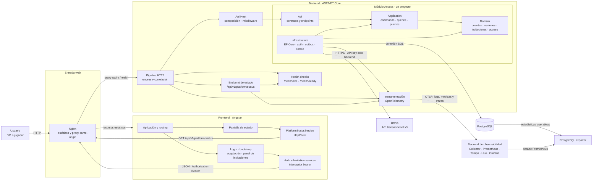

# Diagrama de componentes

- Estado: vigente
- ADR relacionados: [ADR-0001: plataforma y observabilidad](../adr/0001-monorepositorio-y-monolito-modular.md) y [ADR-0002: identidad e invitaciones](../adr/0002-identidad-invitaciones-y-correo-transaccional.md)
- Alcance: componentes lógicos de la plataforma y flujo funcional de identidad e invitaciones

Esta vista describe las responsabilidades y dependencias de la plataforma. No define todavía componentes de dominio ni incorpora información específica de ninguna campaña.

## Responsabilidades

| Componente | Responsabilidad | No debe asumir |
|---|---|---|
| Angular | Presentación, navegación y consumo de la API | Autoridad de seguridad o acceso directo a datos |
| Nginx | Servir el build y mantener `/api` y `/health` bajo el mismo origen | Reglas de dominio |
| Api Host | Composición de módulos, middleware transversal, health y diagnóstico | Casos de uso, EF Core o contratos funcionales de Access |
| Módulo Access | Propiedad de cuentas, sesiones, invitaciones y concesiones actuales de acceso | Consumir internals o tablas de futuros módulos |
| Dominio de invitaciones | Estados, caducidad de siete días y validación del token de un solo uso | Enviar correo o exponer el token persistido |
| Identidad y sesiones | Validar credenciales, emitir y revocar sesiones opacas | Permitir autorregistro o guardar tokens de sesión en claro |
| Worker de outbox | Entregar invitaciones con reintentos y eliminar el ciphertext tras procesarlo | Conceder permisos o registrar destinatarios y tokens |
| Puerto y adaptador Brevo | Aislar el proveedor y enviar correo transaccional por HTTPS | Decidir si una invitación concede acceso |
| EF Core/Npgsql | Acceso transaccional a PostgreSQL | Definir por adelantado el modelo de dominio |
| PostgreSQL | Persistencia primaria | Exposición directa al navegador |
| PostgreSQL exporter | Exponer métricas operativas de la base de datos a Prometheus | Servir tráfico público o almacenar credenciales en la imagen |
| OpenTelemetry | Instrumentación neutral respecto del proveedor | Registrar secretos o contenido sensible |
| Stack Grafana LGTM | Recibir, almacenar y consultar telemetría local | Ser la topología de producción |

## Reglas de dependencia

- El navegador solo accede a la API a través de Nginx en el recorrido integrado.
- Angular no se conecta directamente a PostgreSQL ni al collector de telemetría.
- El host solo accede a la fachada pública de cada módulo; no conoce sus capas internas.
- Los tests globales impiden dependencias entre implementaciones de módulos y cada proyecto de tests modular protege sus propias capas.
- Api depende de Application; Application de Domain; Infrastructure implementa los puertos de Application y persiste Domain.
- El dominio de invitaciones no depende de Brevo; el adaptador implementa un puerto de aplicación.
- Brevo solo transporta mensajes. El estado funcional de la invitación permanece en el backend y PostgreSQL.
- La persistencia depende de abstracciones de EF Core; la estructura concreta del dominio se decidirá por separado.
- La indisponibilidad del backend de observabilidad no debe impedir que la API atienda tráfico.
