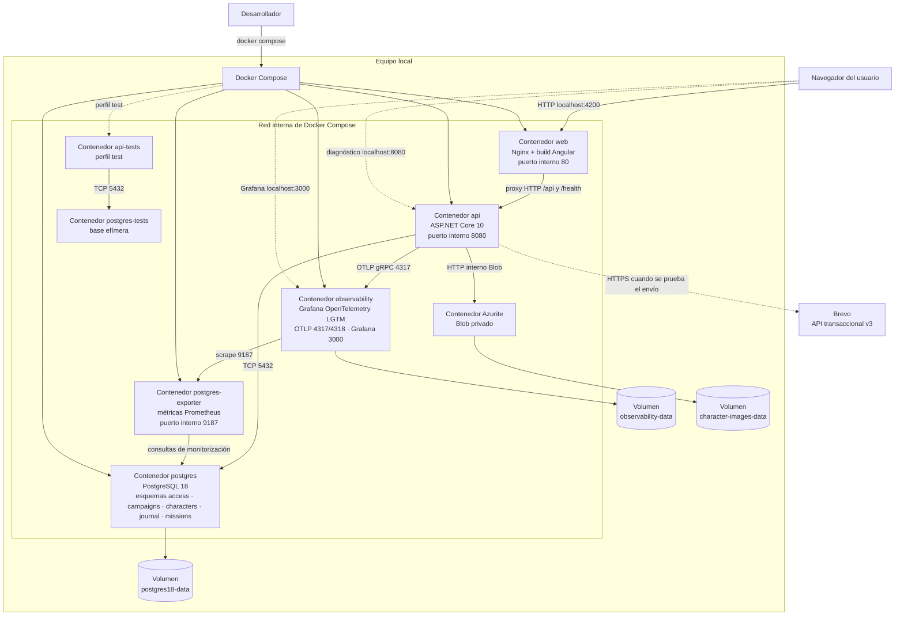
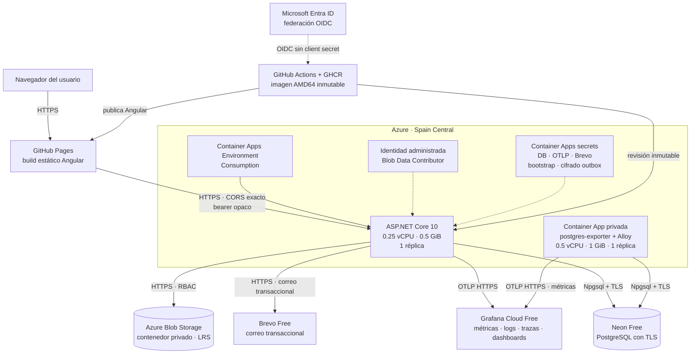

# Diagrama de despliegue

- Estado: vigente
- ADR relacionados: [ADR-0001: plataforma y observabilidad](../adr/0001-monorepositorio-y-monolito-modular.md), [ADR-0002: identidad e invitaciones](../adr/0002-identidad-invitaciones-y-correo-transaccional.md), [ADR-0006: campañas e invitaciones](../adr/0006-campanas-acceso-e-invitaciones.md) y [ADR-0007: imágenes privadas](../adr/0007-imagenes-privadas-de-personajes.md)
- Vista lógica relacionada: [diagrama de componentes](diagrama-de-componentes.md)
- Alcance: entorno local integrado y topología productiva serverless

La primera vista muestra la distribución física del entorno local. La segunda concreta su despliegue productivo con coste acotado sin trasladar al navegador secretos ni responsabilidades del backend.

## Unidades de despliegue

| Servicio | Imagen o build | Puerto publicado | Dependencias de arranque | Persistencia |
|---|---|---:|---|---|
| `web` | `apps/web/Dockerfile` | `4200 → 80` | API saludable | Sin estado |
| `api` | `apps/api/Dockerfile`, target `runtime` | `8080 → 8080` | PostgreSQL y observabilidad saludables | Mediante PostgreSQL |
| `postgres` | `postgres:18-alpine` | `5432 → 5432` | Ninguna | `postgres18-data`, montado en `/var/lib/postgresql` |
| `azurite` | `mcr.microsoft.com/azure-storage/azurite:3.36.0` | No publicado | Ninguna | `character-images-data` |
| `postgres-exporter` | `quay.io/prometheuscommunity/postgres-exporter:v0.20.1` | No publicado | PostgreSQL saludable | Sin estado |
| `observability` | `grafana/otel-lgtm:0.30.0` | `3000 → 3000`, `4317 → 4317`, `4318 → 4318` | Ninguna | `observability-data` |
| `api-tests` | `apps/api/Dockerfile`, target `tests` | No publicado | PostgreSQL saludable | Efímera |
| `postgres-tests` | `postgres:18-alpine`, perfil `test` | No publicado | Ninguna | `tmpfs` efímero |

En producción, `postgres-exporter` y Alloy se ejecutan como sidecars de la Container App `dnd-postgres-observability`; no forman parte del Compose local ni publican ingress.

## Flujo de una petición

1. El navegador solicita la aplicación a `localhost:4200`.
2. Nginx sirve el build Angular.
3. Las llamadas Angular a `/api` vuelven al mismo origen y Nginx las redirige al contenedor `api`.
4. ASP.NET Core consulta PostgreSQL cuando el endpoint lo requiere.
5. La API exporta logs, métricas y trazas por OTLP al contenedor de observabilidad.
6. Grafana permite consultar la telemetría local desde `localhost:3000`.

## Restricciones operativas

- Los puertos publicados son conveniencias del entorno local y deben revisarse para otros entornos.
- Las credenciales por defecto solo son válidas para desarrollo local.
- Las fuentes privadas y la documentación excluida por Git no forman parte del contexto de las imágenes.
- La imagen LGTM local no se utiliza como backend productivo.
- La API key de Brevo se carga desde el `.env` local ignorado por Git y nunca llega al contenedor web.

## Producción serverless con coste acotado

GitHub Pages contiene únicamente HTML, CSS, JavaScript y `config.js` con la URL pública de la API. La API admite CORS exclusivamente desde `https://peterbfoo.github.io`. La sesión opaca vive en `sessionStorage` y PostgreSQL conserva solo su resumen; los secretos de bootstrap, outbox, Brevo y base de datos no llegan al navegador. Azure y GitHub proporcionan TLS administrado.

La Container App privada de observabilidad no tiene ingress. `postgres-exporter` usa el DSN secreto de Neon y expone métricas solo en loopback; Alloy las scrapea y las reenvía a Grafana Cloud por OTLP HTTPS con la autorización inyectada por el workflow.

La infraestructura se describe en `infra/azure`. Terraform crea el grupo de recursos, el entorno Consumption, la Container App, su identidad administrada y la cuenta Blob privada, pero no recibe secretos funcionales. GitHub Actions configura cada revisión mediante OIDC y secrets del environment `production`.
