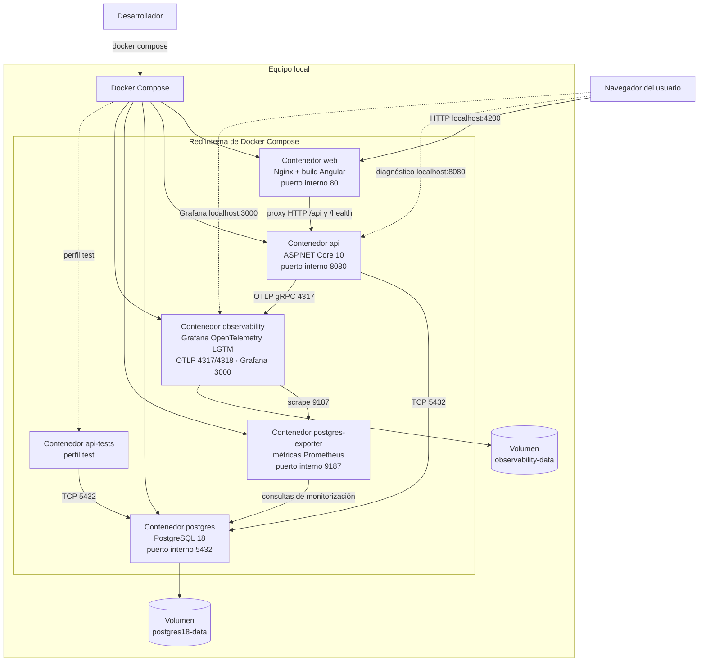

# Diagrama de despliegue

- Estado: vigente
- ADR relacionado: [ADR-0001: plataforma y observabilidad](../adr/ADR-0001-plataforma-y-observabilidad.md)
- Vista lógica relacionada: [diagrama de componentes](diagrama-de-componentes.md)
- Alcance: entorno local integrado definido en `compose.yaml`

Esta vista muestra la distribución física de los componentes del primer incremento. Es una topología de desarrollo e integración local, no un diseño de producción.

## Unidades de despliegue

| Servicio | Imagen o build | Puerto publicado | Dependencias de arranque | Persistencia |
|---|---|---:|---|---|
| `web` | `apps/web/Dockerfile` | `4200 → 80` | API saludable | Sin estado |
| `api` | `apps/api/Dockerfile`, target `runtime` | `8080 → 8080` | PostgreSQL y observabilidad saludables | Mediante PostgreSQL |
| `postgres` | `postgres:18-alpine` | `5432 → 5432` | Ninguna | `postgres18-data`, montado en `/var/lib/postgresql` |
| `postgres-exporter` | `quay.io/prometheuscommunity/postgres-exporter:v0.20.1` | No publicado | PostgreSQL saludable | Sin estado |
| `observability` | `grafana/otel-lgtm:0.30.0` | `3000 → 3000`, `4317 → 4317`, `4318 → 4318` | Ninguna | `observability-data` |
| `api-tests` | `apps/api/Dockerfile`, target `tests` | No publicado | PostgreSQL saludable | Efímera |

## Flujo de una petición

1. El navegador solicita la aplicación a `localhost:4200`.
2. Nginx sirve el build Angular.
3. Las llamadas Angular a `/api` vuelven al mismo origen y Nginx las redirige al contenedor `api`.
4. ASP.NET Core consulta PostgreSQL cuando el endpoint lo requiere.
5. La API exporta logs, métricas y trazas por OTLP al contenedor de observabilidad.
6. Grafana permite consultar la telemetría local desde `localhost:3000`.

## Restricciones operativas

- Los puertos publicados son conveniencias del entorno local y deben revisarse para otros entornos.
- Las credenciales por defecto solo son válidas para desarrollo local.
- Las fuentes privadas y la documentación excluida por Git no forman parte del contexto de las imágenes.
- Una topología de producción deberá concretar red, TLS, identidad, secretos, alta disponibilidad, copias de seguridad y retención de telemetría antes de desplegarse.
