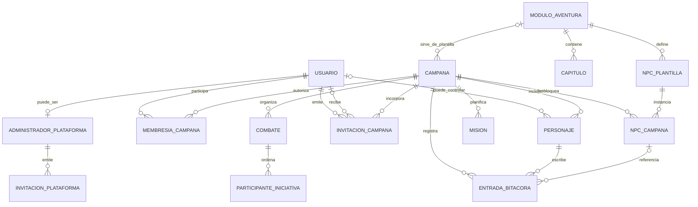

# Roadmap funcional del producto

- Tipo: fuente de roadmap; no es una especificación ejecutable
- Origen: antigua Especificación 001 de requisitos funcionales base
- Creado: 2026-08-19
- Última actualización funcional: 2026-08-29
- Última actualización técnica: 2026-08-30
- Alcance: identidad, alta por invitación, campañas, módulos de aventura y herramientas comunes de juego
- ADR relacionados: [ADR-0002](../adr/0002-identidad-invitaciones-y-correo-transaccional.md), [ADR-0003](../adr/0003-bootstrap-sesiones-y-flujo-de-invitaciones.md) y [ADR-0006](../adr/0006-campanas-acceso-e-invitaciones.md)

## Objetivo

Definir qué debe hacer el producto, cómo se agrupan sus capacidades y en qué orden pueden convertirse en incrementos independientes. Este documento no se implementa directamente, no incorpora contenido concreto de una campaña y no publica recursos editoriales de ningún módulo de aventura.

Cada entrega se define en un spec separado bajo [`docs/specs`](../specs/README.md). El spec selecciona un subconjunto coherente de requisitos `RF-*`, concreta las decisiones que necesita y entrega conjuntamente la experiencia web y el contrato de API necesarios.

## Estado actual de implementación

La tabla distingue comportamiento disponible de extremo a extremo de infraestructura o modelos que todavía no forman una capacidad utilizable.

| Área del roadmap | Requisitos | Estado | Evidencia y límite actual |
|---|---|---|---|
| Identidad y sesión | RF-001 | Implementado | Login, logout, sesión bearer y usuario actual existen en web y API. |
| Roles, aislamiento e incorporación a campaña | RF-002 a RF-004 | Implementado | Campaigns conserva el DM único; Access concede `Jugador` tras aceptación y la API aplica aislamiento en consultas y gestión de invitaciones. |
| Personajes y contexto activo | RF-005 a RF-008 | Implementado | Spec 005 aporta CRUD autorizado, vínculo opcional, imagen privada y un único personaje activo por jugador y campaña; spec 006 presenta los activos en la portada y separa la gestión por rol. |
| DM único | RF-009 | Implementado | `DmUserId` es obligatorio en el agregado Campaign y se fija atómicamente al crearla. |
| Campañas y catálogo de módulos | RF-010 a RF-019 | Parcial | El spec 012 completa el catálogo administrable y sus portadas privadas. El spec 013 implementa la asociación opcional a campañas; capítulos, mapas, localizaciones y viajes siguen pendientes. |
| Librería y NPC | RF-020 a RF-026 | Parcial | El elenco de RF-020 y su resumen de activos están disponibles; NPC y desbloqueos siguen pendientes. |
| Bitácora | RF-030 a RF-035 | Parcial | El spec 007 implementa bitácora independiente, autoría mediante personaje activo, texto compartido, orden, edición colaborativa, eliminación por creador y consulta DM. Referencias seguras a NPC de RF-033 y RF-034 siguen pendientes. |
| Calendario y misiones | RF-040 a RF-045 | Parcial | Spec 008 implementado con pruebas web/API y PostgreSQL; queda pendiente la construcción adicional de las imágenes finales por el límite del sistema de aprobaciones. |
| Iniciativa de combate | RF-050 a RF-057 | Implementado; ampliación en curso | El [spec 009](../specs/009-encuentros-iniciativa/spec.md) aporta el recorrido base. El [spec 010](../specs/010-grupos-enemigos-eliminacion-encuentros/spec.md) amplía grupos con turno compartido, vida individual y eliminación segura. |
| Capítulos y recursos | RF-060 a RF-066 | Pendiente | Los specs 014 a 018 proponen la capacidad funcional y el spec 020 su primera validación editorial; todavía no existe implementación. |
| Alta e invitaciones de plataforma | RF-069 a RF-072 | Implementado | Bootstrap inicial, panel de administración, registro por invitación y alta sin acceso a campañas están disponibles. El bootstrap de la primera cuenta es la excepción deliberada a RF-069 definida por ADR-0003. |
| Creación y DM de campaña | RF-073 y RF-074 | Implementado | Cualquier cuenta autenticada crea una campaña sin módulo y queda como su único DM. |
| Invitaciones de campaña | RF-075 a RF-083 | Implementado | El DM busca cuentas elegibles con datos minimizados, invita por identificador y Access concede exclusivamente `Jugador` tras aceptación. Se conserva la invitación compatible por correo. |
| Eliminación de campañas | RF-084 | Implementado | El spec 011 permite al DM retirar una campaña, revoca el acceso mediante baja lógica e invalida invitaciones pendientes. |

La arquitectura Angular por capacidades del [spec 003](../specs/003-modularizacion-frontend/spec.md) está completada. La extracción modular de Access del [spec 002](../specs/002-modularizacion-access/spec.md) continúa en curso y debe cerrarse según sus propias tareas antes de considerar terminada esa mejora técnica. El [spec 007](../specs/007-bitacora-campana/spec.md) completa el primer incremento de bitácora; la referencia opcional a NPC continúa pendiente hasta disponer de Library. Los specs [012](../specs/012-libreria-modulos/spec.md) a [017](../specs/017-viajes-cuadricula/spec.md) concretan como propuestas la fila 3; los specs [018](../specs/018-npc-modulo/spec.md) y [019](../specs/019-visibilidad-npc-campana/spec.md) concretan la fila 5; y el [spec 020](../specs/020-contenido-brujaluz/spec.md) valida editorialmente esas capacidades sin introducir excepciones de producto. El [spec 022](../specs/022-exporter-postgresql-grafana-cloud/spec.md) deja implementado el pipeline técnico de métricas PostgreSQL para la topología productiva; el [spec 023](../specs/023-observabilidad-postgresql-bajo-demanda/spec.md) desplegó la plantilla conjunta, verificó escala a cero y retiró la Container App permanente, con seguimiento diferido de coste y entrega funcional. El [spec 008](../specs/008-calendario-misiones/spec.md) implementa calendario y misiones. Los specs [009](../specs/009-encuentros-iniciativa/spec.md) y [010](../specs/010-grupos-enemigos-eliminacion-encuentros/spec.md) cubren Combat. El spec [011](../specs/011-eliminacion-campanas/spec.md) amplía el ciclo de vida de Campaigns. El siguiente identificador reservado para un spec nuevo es `024`.

## Incrementos previstos por módulo

Esta secuencia orienta los próximos specs, pero no sustituye sus decisiones ni sus criterios de aceptación. Cada fila debe convertirse en uno o más specs verticales si no cabe de forma segura en un solo incremento.

| Orden | Módulo de software | Capacidad candidata | Requisitos principales | Dependencias |
|---:|---|---|---|---|
| 0 | Access | Terminar su modularización técnica y verificación | Sin ampliar alcance funcional | Spec 002 |
| 1 | Campaigns | Crear y consultar campañas sin exigir módulo y asignar un único DM | RF-009 a RF-011, RF-014, RF-073, RF-074 | Access estable |
| 2 | Access + Campaigns | Buscar usuarios activos elegibles e integrar las invitaciones existentes con campañas reales | RF-002 a RF-004, RF-075 a RF-083 | Campaigns |
| 3 | AdventureCatalog | Catálogo administrable y asociación opcional, contenido estructurado y mapas con viaje | RF-010, RF-011, RF-013 a RF-019 | Campaigns |
| 4 | Characters | Crear, asociar, listar y seleccionar el personaje activo | RF-005 a RF-008, RF-012, RF-020 | Campaigns |
| 5 | Library | Catálogo de NPC, desbloqueo por campaña y vistas diferenciadas | RF-021 a RF-026 | Campaigns, AdventureCatalog |
| 6 | AdventureContent | Capítulos y recursos de dirección con procedencia verificable | RF-060 a RF-066 | Campaigns, AdventureCatalog |
| 7 | Journal | Bitácora por campaña y referencias seguras a NPC visibles | RF-030 a RF-035 | Characters, Library |
| 8 | Missions | Calendario, misiones y unicidad de la misión principal | RF-040 a RF-045 | Campaigns, Characters |
| 9 | Combat | Iniciativa, turnos, rondas, enemigos y proyección segura para jugadores | RF-050 a RF-057 | Campaigns, Characters |

Las filas 1 y 2 quedaron completadas por el [spec 004](../specs/004-creacion-campanas/spec.md) y la fila 4 por el [spec 005](../specs/005-personajes-campana/spec.md), refinado por el [spec 006](../specs/006-resumen-personajes-activos/spec.md), el 2026-08-23. La fila 7 está completada parcialmente por el [spec 007](../specs/007-bitacora-campana/spec.md), sin incluir todavía referencias a NPC. El [spec 012](../specs/012-libreria-modulos/spec.md) completa el catálogo inicial y el [spec 013](../specs/013-asignacion-modulo-campana/spec.md) continúa su asociación a campañas; los specs [014](../specs/014-capitulos-modulo/spec.md) a [017](../specs/017-viajes-cuadricula/spec.md) concretan las capacidades restantes de la fila 3, los specs [018](../specs/018-npc-modulo/spec.md) y [019](../specs/019-visibilidad-npc-campana/spec.md) concretan la fila 5, y el [spec 020](../specs/020-contenido-brujaluz/spec.md) valida editorialmente esas capacidades sin introducir excepciones de producto. El [spec 022](../specs/022-exporter-postgresql-grafana-cloud/spec.md) completa el pipeline técnico de métricas PostgreSQL para la topología productiva y el [spec 023](../specs/023-observabilidad-postgresql-bajo-demanda/spec.md) redefine su ciclo de vida productivo bajo demanda. El [spec 008](../specs/008-calendario-misiones/spec.md) implementa calendario y misiones y conserva pendiente únicamente la construcción adicional de imágenes finales. El [spec 009](../specs/009-encuentros-iniciativa/spec.md) completa la fila 9 con la herramienta vertical de Combat y su proyección segura; el [spec 010](../specs/010-grupos-enemigos-eliminacion-encuentros/spec.md) amplía esa misma fila. El spec [011](../specs/011-eliminacion-campanas/spec.md) amplía el ciclo de vida de Campaigns. El siguiente identificador disponible es `024`; no se crean de antemano specs vacíos para las demás filas.

## Restricciones tecnológicas aceptadas

- **Correo transaccional mediante Brevo.** Las invitaciones y los demás mensajes de identidad que se concreten utilizarán Brevo como proveedor de envío. La elección se basa en disponer de un plan gratuito suficiente para el alcance inicial, API y SDK para C#, webhooks de entrega y alojamiento de datos en la Unión Europea.
- La API key y la dirección remitente verificada de Brevo serán secretos independientes y exclusivos del backend. No se incluirán en el repositorio, en imágenes de contenedor ni en el frontend.
- **Documentación independiente del corpus editorial.** Los ADR, especificaciones, planes, diagramas y documentos operativos usarán conceptos y ejemplos genéricos. Podrán identificar un módulo concreto cuando exista autorización expresa y fundamento de uso verificable, pero no reproducirán su corpus, imágenes, mapas ni detalles editoriales.

## Vocabulario

- **Usuario**: cuenta que accede mediante credenciales.
- **Administrador de plataforma**: actor de alcance global que administra el acceso inicial al ecosistema. No es un rol de campaña y no obtiene por ello acceso al contenido de las campañas.
- **DM**: usuario que ocupa el rol de dirección dentro de una campaña concreta. Cada campaña tiene exactamente un DM.
- **Jugador**: usuario que ocupa el rol de jugador dentro de una campaña concreta y participa mediante uno de sus personajes.
- **Personaje**: identidad de juego controlada por un usuario y vinculada a una única campaña.
- **Módulo de aventura**: plantilla de contenido que puede asociarse a una campaña. No debe confundirse con un módulo de software.
- **Campaña**: espacio independiente de juego para un grupo concreto, con o sin módulo de aventura asociado.
- **NPC**: personaje no jugador definido por el módulo y cuyo conocimiento se desbloquea independientemente en cada campaña.
- **Capítulo**: sección del módulo que agrupa recursos de dirección como mapas, localizaciones e información relevante.
- **Personaje activo**: personaje con el que un usuario ha decidido participar durante su sesión actual.
- **Invitación de plataforma**: invitación genérica para crear una cuenta sin asociarla automáticamente a una campaña.
- **Invitación de campaña**: invitación emitida por el DM para incorporar como jugador a un usuario registrado o a una persona que todavía debe crear su cuenta.

## Modelo funcional

Las relaciones anteriores son funcionales. No prescriben tablas, agregados, endpoints ni límites internos del backend.

## Actores y permisos preliminares

### Capacidades de plataforma

| Capacidad | Administrador de plataforma | Usuario registrado |
|---|---:|---:|
| Iniciar sesión | Sí | Sí |
| Enviar una invitación genérica al ecosistema | Sí | No |
| Consultar y revocar invitaciones genéricas | Sí | No |
| Crear una campaña con o sin módulo | Sí, si actúa como usuario | Sí |
| Convertirse en DM de la campaña creada | Sí | Sí |

### Capacidades dentro de una campaña

| Capacidad | DM | Jugador |
|---|---:|---:|
| Iniciar sesión con credenciales | Sí | Sí |
| Seleccionar uno de sus personajes | Sí, cuando actúe como personaje | Sí |
| Crear personajes | Sí, vinculados o sin jugador | Sí, solo propios |
| Editar o eliminar personajes | Sí, cualquiera de su campaña | Sí, solo propios |
| Crear o invitar jugadores | Sí | No |
| Consultar personajes de su campaña | Sí | Sí |
| Consultar todos los NPC del módulo | Sí | No |
| Consultar NPC desbloqueados | Sí | Sí |
| Desbloquear un NPC para la campaña | Sí | No |
| Consultar recursos y capítulos del módulo | Sí | No |
| Operar la iniciativa y los enemigos | Sí | No |
| Consultar la bitácora | Sí | Sí |
| Crear entradas de bitácora | No | Sí |
| Crear misiones | Sí | Sí |
| Actualizar misiones | Por confirmar | Por confirmar |
| Consultar calendario y misiones | Sí | Sí |
| Ver el orden de iniciativa | Sí | Sí |
| Ver vida y detalles privados de enemigos | Sí | No |

Ningún permiso del frontend sustituye la autorización del backend. Toda operación debe comprobar usuario, rol, campaña y, cuando corresponda, personaje activo.

## Requisitos funcionales

### Identidad, acceso y roles

- **RF-001 — Acceso autenticado.** El sistema permitirá iniciar y cerrar sesión mediante credenciales asociadas a un usuario.
- **RF-002 — Roles por campaña.** El sistema distinguirá los roles `DM` y `Jugador` dentro de cada campaña y aplicará sus permisos en el backend. Un mismo usuario podrá tener roles diferentes en campañas distintas. El administrador de plataforma será un actor global independiente y no constituirá un tercer rol de campaña.
- **RF-003 — Aislamiento.** Un usuario solo podrá consultar o modificar campañas, personajes y contenido para los que tenga autorización explícita.
- **RF-004 — Incorporación de jugadores.** Un DM podrá invitar a usuarios registrados o a personas sin cuenta para incorporarlos como jugadores de su campaña. Toda membresía de jugador quedará asociada a una cuenta de usuario.
- **RF-005 — Personajes del usuario.** Un usuario podrá controlar varios personajes, incluso pertenecientes a campañas diferentes.
- **RF-006 — Selección de personaje.** El primer personaje del usuario en una campaña quedará activo automáticamente; después podrá seleccionar otro de sus personajes autorizados antes de realizar acciones que requieran contexto de jugador.
- **RF-007 — Cambio de contexto.** El usuario podrá cambiar de personaje activo sin autenticarse de nuevo, siempre que no exista una operación que deba concluir antes.
- **RF-008 — Ausencia de personajes.** Si el usuario no tiene personajes disponibles en una campaña, el sistema mostrará ese estado y permitirá entrar únicamente para consultar el elenco y crear el primero; no permitirá acciones de juego que requieran personaje activo.
- **RF-009 — DM único.** Cada campaña tendrá exactamente un usuario con rol `DM`. Ninguna operación podrá dejar una campaña activa sin DM ni asignarle dos simultáneamente.

### Campañas y módulos de aventura

- **RF-010 — Creación de campaña.** Cualquier usuario registrado podrá crear una campaña nueva indicando como mínimo un nombre. La selección de un módulo de aventura será opcional. Al completarse la creación, se convertirá en el único DM de esa campaña.
- **RF-011 — Asociación opcional y única.** Cada campaña podrá no tener módulo o estar asociada como máximo a uno. Un mismo módulo podrá servir de plantilla para varias campañas independientes y podrá asociarse posteriormente cuando esté disponible en el ecosistema.
- **RF-012 — Asociación del personaje.** Cada personaje pertenecerá a exactamente una campaña. Podrá estar vinculado a un único jugador responsable o quedar sin propietario cuando lo cree el DM; un personaje sin propietario no podrá estar activo.
- **RF-013 — Contenido independiente por módulo.** Cada módulo dispondrá de sus propios capítulos, NPC y recursos editoriales.
- **RF-014 — Estado independiente por campaña.** El progreso, NPC desbloqueados, bitácora, misiones y combates no se compartirán entre campañas aunque utilicen el mismo módulo.
- **RF-015 — Acceso del DM.** El único DM de una campaña podrá consultar desde el inicio todo el contenido de dirección del módulo seleccionado.
- **RF-016 — Administración del catálogo.** Solo un administrador de plataforma podrá crear, editar y eliminar módulos y su contenido base. Los DM podrán seleccionarlos y consumirlos desde sus campañas sin adquirir permisos de autoría.
- **RF-017 — Contenido editable y eliminación segura.** Los cambios de un módulo se reflejarán en todas las campañas que lo utilicen. Eliminarlo retirará sus referencias y contenido sin eliminar campañas.
- **RF-018 — Mapas y localizaciones reutilizables.** Un módulo podrá definir mapas, localizaciones y puntos de interés, relacionarlos con capítulos y reutilizar cada recurso sin duplicarlo. Las posiciones pertenecerán a la relación correspondiente.
- **RF-019 — Viaje opcional por cuadrícula.** Un mapa podrá declarar una cuadrícula cuadrada o hexagonal y, de forma independiente, habilitar el cálculo de distancia escalada entre localizaciones colocadas, sin calcular rutas ni estado de viaje.

### Librería de campaña y NPC

- **RF-020 — Personajes de campaña.** La librería mostrará los personajes pertenecientes a la campaña activa.
- **RF-021 — Catálogo de NPC.** La librería incluirá un apartado específico para los NPC del módulo.
- **RF-022 — Desbloqueo por campaña.** Los NPC comenzarán bloqueados para los jugadores y únicamente un DM autorizado podrá desbloquearlos en la campaña correspondiente.
- **RF-023 — Visibilidad del DM.** El DM podrá consultar los NPC bloqueados y desbloqueados, así como su estado de visibilidad para los jugadores.
- **RF-024 — Visibilidad del jugador.** Un jugador solo podrá consultar los NPC desbloqueados en su campaña. Una vez desbloqueado, verá toda su información pública, incluidas imagen, nombre y descripción.
- **RF-025 — Estadísticas reservadas.** Un NPC podrá contener estadísticas de combate, pero estas permanecerán visibles únicamente para el DM incluso después de desbloquear el NPC.
- **RF-026 — Efecto inmediato.** Al desbloquear un NPC, este pasará a estar disponible para todos los jugadores autorizados de esa campaña.

### Bitácora

- **RF-030 — Bitácora por campaña.** Cada campaña contará con una bitácora independiente.
- **RF-031 — Registro mediante personaje.** Las entradas serán creadas por jugadores, quedarán asociadas al personaje activo y conservarán autor y fecha de creación.
- **RF-032 — Contenido libre.** La bitácora permitirá registrar sucesos, pistas e información obtenida durante la campaña.
- **RF-033 — Referencia a NPC.** Una entrada podrá vincularse opcionalmente con un NPC visible en la campaña.
- **RF-034 — Protección de información.** Una entrada no podrá revelar indirectamente a un jugador un NPC o contenido que todavía no tenga permitido consultar.
- **RF-035 — Consulta del DM.** El DM podrá consultar la bitácora completa de su campaña, pero no creará entradas de bitácora en el alcance inicial.

### Calendario y misiones

- **RF-040 — Calendario de campaña.** Cada campaña dispondrá de un calendario donde registrar las misiones aceptadas por el grupo.
- **RF-041 — Misión principal.** Como máximo una misión estará marcada como principal en cada campaña.
- **RF-042 — Prioridad visual.** La misión principal aparecerá antes que el resto de misiones independientemente del criterio de orden secundario.
- **RF-043 — Cambio de misión principal.** Marcar otra misión como principal retirará automáticamente esa condición de la anterior.
- **RF-044 — Evolución de misión.** Una misión podrá actualizarse durante la campaña sin perder su identidad ni su relación con el calendario.
- **RF-045 — Autoría de misiones.** Los jugadores podrán registrar misiones y el DM también podrá crear una misión cuando lo considere necesario.

### Iniciativa de combate

- **RF-050 — Uso exclusivo del DM.** Solo un DM autorizado podrá crear, modificar, avanzar o finalizar una iniciativa.
- **RF-051 — Participantes.** El DM podrá añadir a la iniciativa personajes de la campaña y enemigos creados para el combate.
- **RF-052 — Enemigos.** Cada enemigo incorporado tendrá como mínimo un nombre y sus puntos de vida actuales y máximos.
- **RF-053 — Orden de iniciativa.** El sistema ordenará los participantes de acuerdo con las reglas de iniciativa de D&D 5.5 y permitirá resolver empates según las reglas que se concreten.
- **RF-054 — Turnos y rondas.** El sistema identificará el participante activo y permitirá avanzar por turnos y rondas sin alterar el orden accidentalmente.
- **RF-055 — Vida de enemigos.** El DM podrá aumentar o reducir la vida de los enemigos y el sistema conservará el estado durante el combate.
- **RF-056 — Aislamiento del combate.** Una iniciativa solo podrá incluir personajes y estado pertenecientes a su campaña.
- **RF-057 — Vista del jugador.** Los jugadores podrán ver el orden y el turno actual de la iniciativa, pero no podrán controlarla ni consultar la vida u otros detalles privados de los enemigos.

### Capítulos y recursos del módulo

- **RF-060 — Sección de capítulos.** Cada módulo contará con una sección ordenada de capítulos.
- **RF-061 — Recursos de dirección.** Cada capítulo podrá incluir mapas, localizaciones, imágenes, documentación e información relevante para dirigirlo.
- **RF-062 — Acceso reservado.** Los capítulos y recursos de dirección estarán disponibles únicamente para el DM de la campaña.
- **RF-063 — Contexto de campaña.** El DM accederá a los capítulos desde una campaña concreta, aunque el contenido base proceda del módulo seleccionado.
- **RF-064 — Redacción original.** El contenido editorial incorporado se redactará de forma original a partir de las fuentes de referencia; no se copiarán ni republicarán textos, capítulos o recursos oficiales de forma literal.
- **RF-065 — Imágenes autorizadas.** Solo se incorporarán imágenes oficiales cuando su reutilización esté amparada por una licencia, permiso o política aplicable. El mero hecho de que una imagen sea accesible públicamente en una web de Wizards no bastará para considerarla reutilizable.
- **RF-066 — Contenido de fans.** Cuando se utilice propiedad intelectual al amparo de la política de contenido de fans de Wizards, la aplicación permanecerá gratuita, se identificará como contenido no oficial e incluirá el aviso y atribución exigidos por dicha política.

La referencia de cumplimiento será la [Política de contenido de fans de Wizards of the Coast](https://company.wizards.com/es/legal/fancontentpolicy). Esta política contempla contenido de fans gratuito y partidas privadas con acceso, pero considera las imágenes y textos parte de la propiedad intelectual de Wizards y no permite republicar literalmente su contenido. Cada recurso deberá conservar procedencia y fundamento de uso verificables.

### Alta e invitaciones

- **RF-069 — Alta exclusivamente por invitación.** No existirá autorregistro público. Toda cuenta deberá proceder de una invitación de plataforma o de campaña válida.
- **RF-070 — Panel de invitaciones.** El administrador de plataforma dispondrá de un panel para enviar, consultar y revocar invitaciones de acceso al ecosistema.
- **RF-071 — Registro por invitación.** Una persona sin cuenta podrá aceptar una invitación válida y crear sus credenciales de usuario.
- **RF-072 — Invitación genérica.** Aceptar una invitación de plataforma creará la cuenta, pero no concederá acceso automático a ninguna campaña.
- **RF-073 — Creación abierta a usuarios.** Cualquier usuario registrado podrá crear una campaña indicando un nombre, con o sin un módulo disponible.
- **RF-074 — DM creador.** El creador de una campaña se convertirá automáticamente en su único DM.
- **RF-075 — Invitación a usuario registrado.** El DM podrá invitar a un usuario ya registrado para que se incorpore a su campaña con rol `Jugador`.
- **RF-076 — Invitación a persona no registrada.** El DM podrá enviar una invitación de campaña a una persona sin cuenta. Al aceptarla, primero creará su usuario y después se incorporará a esa campaña como jugador.
- **RF-077 — Aceptación explícita.** Enviar una invitación no incorporará al destinatario hasta que este la acepte autenticado o complete el registro correspondiente.
- **RF-078 — Cuenta única.** Si el destinatario ya tiene una cuenta asociada a la identidad invitada, deberá autenticarse con ella y no se creará un usuario duplicado.
- **RF-079 — Ciclo de vida.** Las invitaciones tendrán estados `pendiente`, `aceptada`, `caducada` y `revocada`, y caducarán exactamente siete días después de su emisión. Solo una invitación pendiente y vigente podrá utilizarse.
- **RF-080 — Token de invitación.** La aceptación utilizará un token impredecible, con caducidad y de un solo uso. El token no concederá por sí solo acceso a datos privados antes de completar la autenticación o el registro.
- **RF-081 — Gestión por el DM.** El DM podrá consultar el estado, revocar y volver a enviar las invitaciones de su campaña, pero no administrar invitaciones o usuarios ajenos a ella.
- **RF-082 — Sin escalado de rol.** Las invitaciones de campaña incorporarán únicamente jugadores; aceptar una invitación nunca podrá crear otro DM ni sustituir al DM existente.
- **RF-083 — Selección de usuarios activos.** El DM podrá listar o buscar, dentro del contexto de su campaña, usuarios activos elegibles para invitación. La selección usará un identificador estable, no expondrá correos completos y excluirá al DM, miembros e invitaciones pendientes.
- **RF-084 — Eliminación de campaña.** El único DM podrá eliminar una campaña con confirmación explícita. La campaña dejará de estar disponible para cualquier participante y sus invitaciones pendientes no podrán conceder acceso.

## Criterios de aceptación transversales

1. Un usuario registrado crea una campaña con o sin módulo y se convierte en su único DM; si posteriormente tiene un módulo asociado, el DM puede consultar sus capítulos y un jugador no.
2. Cada campaña conserva exactamente un DM; ese DM incorpora un jugador, se asocia una cuenta de usuario y se le asigna al menos un personaje de la campaña.
3. Al iniciar sesión con varios personajes, el usuario debe escoger uno y todas sus acciones posteriores quedan limitadas a ese contexto.
4. Un NPC bloqueado es visible para el DM pero no para los jugadores; después del desbloqueo aparece con toda su información pública, pero nunca muestra a los jugadores sus estadísticas de combate.
5. Desbloquear un NPC en una campaña no lo desbloquea en otra campaña del mismo módulo.
6. Una entrada de bitácora identifica al personaje jugador que la creó y no permite referenciar contenido que ese personaje no puede consultar; el DM puede leerla, pero no crear entradas.
7. Al cambiar la misión principal, solo la nueva permanece marcada y aparece en primer lugar.
8. Un jugador puede ver el orden y turno actual de la iniciativa, pero no puede operarla ni consultar la vida de los enemigos aunque invoque directamente la API.
9. Un DM puede ordenar personajes y enemigos, avanzar turnos y modificar la vida de los enemigos sin que el estado se mezcle con otra campaña.
10. Un usuario no puede acceder a datos de otra campaña modificando identificadores o rutas.
11. El administrador invita a una persona al ecosistema; al aceptar, esta crea sus credenciales, pero no obtiene acceso a ninguna campaña.
12. Un usuario registrado crea una campaña indicando un nombre, sin necesidad de que el módulo esté cargado, y queda asignado automáticamente como su único DM.
13. El DM invita a un usuario registrado; el destinatario inicia sesión, acepta y entra exclusivamente como jugador de esa campaña.
14. El DM invita a una persona no registrada; el destinatario crea su cuenta, acepta la invitación y entra como jugador sin generar un usuario duplicado.
15. Una invitación caducada, revocada o ya aceptada no puede volver a utilizarse ni revelar información privada de la campaña.

## Decisiones funcionales pendientes

Cada pregunta debe resolverse en el primer spec que dependa de ella y, si la decisión es transversal o difícil de revertir, en un ADR asociado:

1. **Resuelto en ADR-0003.** La primera administración utiliza un secreto de bootstrap de un solo uso funcional y el endpoint se cierra cuando existe cualquier cuenta.
2. **Resuelto en ADR-0003.** El reenvío rota la invitación, exige 15 minutos entre emisiones y admite como máximo cinco en 24 horas para una misma dirección y contexto.
3. **Resuelto parcialmente en ADR-0003.** La invitación válida acredita inicialmente el control del correo y la contraseña sigue la política definida; recuperación y cambio de credenciales quedan pendientes.
4. ¿Cómo se transfiere el rol de DM único o se archiva una campaña sin dejarla en un estado inválido?
5. ¿Puede un usuario controlar varios personajes dentro de la misma campaña?
6. ¿Quién crea y asocia el primer personaje después de aceptar una invitación de campaña: el DM o el jugador?
7. ¿Puede el DM controlar también un personaje dentro de la campaña que dirige y, en ese caso, debe seleccionar un personaje activo?
8. **Resuelto para bitácora en spec 007 y para misiones en spec 008.** En misiones, DM y jugadores aceptados pueden editar cualquier misión; un jugador elimina solo las que creó y el DM puede eliminar cualquiera de su campaña.
9. **Resuelto para bitácora en spec 007.** Las entradas son siempre compartidas dentro de la campaña; no existen borradores ni entradas privadas en el alcance inicial.
10. **Resuelto en spec 008 para el alcance inicial.** Las misiones usan los estados `Activa`, `Completada`, `Fallida` y `Cancelada`; no tienen fecha de aceptación, fecha objetivo ni recurrencia. El calendario se concreta como un registro ordenado con la principal primero.
11. **Resuelto en spec 009 para el alcance inicial.** La vista del jugador se actualizará mediante sondeo cada 5 segundos y mostrará nombre, tipo, iniciativa y turno, pero no CA, vida ni controles de los enemigos.
12. **Resuelto en spec 009 para el alcance inicial.** El DM introducirá el total de iniciativa del encuentro y resolverá expresamente el orden relativo de los empates antes de activarlo; sorpresa y cálculo automático de tiradas quedan fuera del primer incremento.
13. **Concretado como propuesta en spec 014.** Los capítulos son una biblioteca completa para el DM, sin progreso, capítulo actual ni desbloqueo.
14. **Concretado como propuesta en specs 012 a 020.** Cada texto e imagen conserva tipo de procedencia, referencia, fundamento de uso, atribución, fecha y actor de verificación; el spec 020 exige además evidencia por recurso para la carga real.
15. **Resuelto en ADR-0006.** Una campaña puede crearse sin módulo y asociar como máximo uno cuando esa capacidad exista.
16. **Resuelto en ADR-0006.** Consultar una campaña existente sin autorización responde `403`.
17. **Resuelto en ADR-0006.** Access mantiene invitaciones y ofrece al DM una búsqueda contextual de usuarios activos elegibles con datos minimizados.

## Fuera de alcance por ahora

- ampliaciones de autenticación y autorización distintas de las ya implementadas;
- hojas de personaje completas, creación de estadísticas, inventario, subida de nivel o tiradas de dados;
- tablero virtual, movimiento de fichas, chat, audio o vídeo;
- compra, descarga o edición colaborativa de módulos;
- publicación de contenido editorial protegido o información específica de una campaña;
- decisiones de persistencia, API, sincronización en tiempo real o almacenamiento de imágenes, que deberán justificarse después mediante plan o ADR.

## Gobierno y actualización

Este roadmap no pasa a estado `Aceptado` ni genera un único plan de implementación. Evoluciona durante toda la vida del producto.

- Un requisito solo se marca implementado cuando el spec correspondiente está terminado y existe evidencia en código y pruebas.
- El estado parcial debe explicar qué recorrido falta; no equivale a una entrega completa.
- Los cambios de alcance actualizan primero este documento y después se concretan en un spec independiente.
- Las decisiones abiertas permanecen aquí hasta que un spec o ADR las resuelva y enlace la respuesta.
- Los criterios transversales se reparten entre specs y cada uno incorpora solo los que pueda verificar de extremo a extremo.
