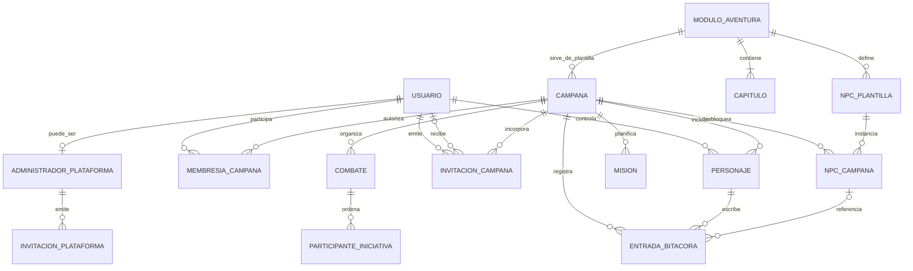

# Especificación 001: requisitos funcionales base

- Estado: Borrador para validación
- Fecha: 2026-08-19
- Alcance: identidad, alta por invitación, campañas, módulos de aventura y herramientas comunes de juego
- ADR relacionados: [ADR-0002](../../adr/0002-identidad-invitaciones-y-correo-transaccional.md), limitado a las decisiones de identidad e invitaciones ya confirmadas

## Objetivo

Definir qué debe hacer el producto antes de decidir cómo se implementarán la identidad, la autorización, el modelo de campaña o la gestión del contenido. Esta especificación no incorpora contenido concreto de una campaña ni publica recursos editoriales de ningún módulo de aventura.

## Restricciones tecnológicas aceptadas

- **Correo transaccional mediante Brevo.** Las invitaciones y los demás mensajes de identidad que se concreten utilizarán Brevo como proveedor de envío. La elección se basa en disponer de un plan gratuito suficiente para el alcance inicial, API y SDK para C#, webhooks de entrega y alojamiento de datos en la Unión Europea.
- La API key y la dirección remitente verificada de Brevo serán secretos independientes y exclusivos del backend. No se incluirán en el repositorio, en imágenes de contenedor ni en el frontend.
- **Documentación independiente del contenido editorial.** Los ADR, especificaciones, planes, diagramas y documentos operativos no incluirán nombres ni información propia de campañas o módulos de aventura concretos. Usarán únicamente conceptos y ejemplos genéricos.

## Vocabulario

- **Usuario**: cuenta que accede mediante credenciales.
- **Administrador de plataforma**: actor de alcance global que administra el acceso inicial al ecosistema. No es un rol de campaña y no obtiene por ello acceso al contenido de las campañas.
- **DM**: usuario que ocupa el rol de dirección dentro de una campaña concreta. Cada campaña tiene exactamente un DM.
- **Jugador**: usuario que ocupa el rol de jugador dentro de una campaña concreta y participa mediante uno de sus personajes.
- **Personaje**: identidad de juego controlada por un usuario y vinculada a una única campaña.
- **Módulo de aventura**: plantilla de contenido seleccionable al crear una campaña. No debe confundirse con un módulo de software.
- **Campaña**: ejecución independiente de un módulo de aventura para un grupo concreto.
- **NPC**: personaje no jugador definido por el módulo y cuyo conocimiento se desbloquea independientemente en cada campaña.
- **Capítulo**: sección del módulo que agrupa recursos de dirección como mapas, localizaciones e información relevante.
- **Personaje activo**: personaje con el que un usuario ha decidido participar durante su sesión actual.
- **Invitación de plataforma**: invitación genérica para crear una cuenta sin asociarla automáticamente a una campaña.
- **Invitación de campaña**: invitación emitida por el DM para incorporar como jugador a un usuario registrado o a una persona que todavía debe crear su cuenta.

## Modelo funcional

Las relaciones anteriores son funcionales. No prescriben tablas, agregados, endpoints ni límites internos del backend.

## Actores y permisos preliminares

### Capacidades de plataforma

| Capacidad | Administrador de plataforma | Usuario registrado |
|---|---:|---:|
| Iniciar sesión | Sí | Sí |
| Enviar una invitación genérica al ecosistema | Sí | No |
| Consultar y revocar invitaciones genéricas | Sí | No |
| Crear una campaña seleccionando un módulo | Sí, si actúa como usuario | Sí |
| Convertirse en DM de la campaña creada | Sí | Sí |

### Capacidades dentro de una campaña

| Capacidad | DM | Jugador |
|---|---:|---:|
| Iniciar sesión con credenciales | Sí | Sí |
| Seleccionar uno de sus personajes | Sí, cuando actúe como personaje | Sí |
| Crear o invitar jugadores | Sí | No |
| Consultar personajes de su campaña | Sí | Sí |
| Consultar todos los NPC del módulo | Sí | No |
| Consultar NPC desbloqueados | Sí | Sí |
| Desbloquear un NPC para la campaña | Sí | No |
| Consultar recursos y capítulos del módulo | Sí | No |
| Operar la iniciativa y los enemigos | Sí | No |
| Consultar la bitácora | Sí | Sí |
| Crear entradas de bitácora | No | Sí |
| Crear misiones | Sí | Sí |
| Actualizar misiones | Por confirmar | Por confirmar |
| Consultar calendario y misiones | Sí | Sí |
| Ver el orden de iniciativa | Sí | Sí |
| Ver vida y detalles privados de enemigos | Sí | No |

Ningún permiso del frontend sustituye la autorización del backend. Toda operación debe comprobar usuario, rol, campaña y, cuando corresponda, personaje activo.

## Requisitos funcionales

### Identidad, acceso y roles

- **RF-001 — Acceso autenticado.** El sistema permitirá iniciar y cerrar sesión mediante credenciales asociadas a un usuario.
- **RF-002 — Roles por campaña.** El sistema distinguirá los roles `DM` y `Jugador` dentro de cada campaña y aplicará sus permisos en el backend. Un mismo usuario podrá tener roles diferentes en campañas distintas. El administrador de plataforma será un actor global independiente y no constituirá un tercer rol de campaña.
- **RF-003 — Aislamiento.** Un usuario solo podrá consultar o modificar campañas, personajes y contenido para los que tenga autorización explícita.
- **RF-004 — Incorporación de jugadores.** Un DM podrá invitar a usuarios registrados o a personas sin cuenta para incorporarlos como jugadores de su campaña. Toda membresía de jugador quedará asociada a una cuenta de usuario.
- **RF-005 — Personajes del usuario.** Un usuario podrá controlar varios personajes, incluso pertenecientes a campañas diferentes.
- **RF-006 — Selección de personaje.** Después de autenticarse, el usuario deberá seleccionar uno de sus personajes autorizados antes de realizar acciones como jugador.
- **RF-007 — Cambio de contexto.** El usuario podrá cambiar de personaje activo sin autenticarse de nuevo, siempre que no exista una operación que deba concluir antes.
- **RF-008 — Ausencia de personajes.** Si el usuario no tiene personajes disponibles, el sistema mostrará ese estado y no permitirá entrar en una campaña como jugador.
- **RF-009 — DM único.** Cada campaña tendrá exactamente un usuario con rol `DM`. Ninguna operación podrá dejar una campaña activa sin DM ni asignarle dos simultáneamente.

### Campañas y módulos de aventura

- **RF-010 — Creación de campaña.** Cualquier usuario registrado podrá crear una campaña nueva indicando como mínimo un nombre y seleccionando un módulo de aventura disponible. Al completarse la creación, se convertirá en el único DM de esa campaña.
- **RF-011 — Asociación única.** Cada campaña estará asociada a exactamente un módulo de aventura. Un mismo módulo podrá servir de plantilla para varias campañas independientes.
- **RF-012 — Asociación del personaje.** Cada personaje pertenecerá a exactamente una campaña y a exactamente un usuario responsable.
- **RF-013 — Contenido independiente por módulo.** Cada módulo dispondrá de sus propios capítulos, NPC y recursos editoriales.
- **RF-014 — Estado independiente por campaña.** El progreso, NPC desbloqueados, bitácora, misiones y combates no se compartirán entre campañas aunque utilicen el mismo módulo.
- **RF-015 — Acceso del DM.** El único DM de una campaña podrá consultar desde el inicio todo el contenido de dirección del módulo seleccionado.

### Librería de campaña y NPC

- **RF-020 — Personajes de campaña.** La librería mostrará los personajes pertenecientes a la campaña activa.
- **RF-021 — Catálogo de NPC.** La librería incluirá un apartado específico para los NPC del módulo.
- **RF-022 — Desbloqueo por campaña.** Los NPC comenzarán bloqueados para los jugadores y únicamente un DM autorizado podrá desbloquearlos en la campaña correspondiente.
- **RF-023 — Visibilidad del DM.** El DM podrá consultar los NPC bloqueados y desbloqueados, así como su estado de visibilidad para los jugadores.
- **RF-024 — Visibilidad del jugador.** Un jugador solo podrá consultar los NPC desbloqueados en su campaña. Una vez desbloqueado, verá toda su información pública, incluidas imagen, nombre y descripción.
- **RF-025 — Estadísticas reservadas.** Un NPC podrá contener estadísticas de combate, pero estas permanecerán visibles únicamente para el DM incluso después de desbloquear el NPC.
- **RF-026 — Efecto inmediato.** Al desbloquear un NPC, este pasará a estar disponible para todos los jugadores autorizados de esa campaña.

### Bitácora

- **RF-030 — Bitácora por campaña.** Cada campaña contará con una bitácora independiente.
- **RF-031 — Registro mediante personaje.** Las entradas serán creadas por jugadores, quedarán asociadas al personaje activo y conservarán autor y fecha de creación.
- **RF-032 — Contenido libre.** La bitácora permitirá registrar sucesos, pistas e información obtenida durante la campaña.
- **RF-033 — Referencia a NPC.** Una entrada podrá vincularse opcionalmente con un NPC visible en la campaña.
- **RF-034 — Protección de información.** Una entrada no podrá revelar indirectamente a un jugador un NPC o contenido que todavía no tenga permitido consultar.
- **RF-035 — Consulta del DM.** El DM podrá consultar la bitácora completa de su campaña, pero no creará entradas de bitácora en el alcance inicial.

### Calendario y misiones

- **RF-040 — Calendario de campaña.** Cada campaña dispondrá de un calendario donde registrar las misiones aceptadas por el grupo.
- **RF-041 — Misión principal.** Como máximo una misión estará marcada como principal en cada campaña.
- **RF-042 — Prioridad visual.** La misión principal aparecerá antes que el resto de misiones independientemente del criterio de orden secundario.
- **RF-043 — Cambio de misión principal.** Marcar otra misión como principal retirará automáticamente esa condición de la anterior.
- **RF-044 — Evolución de misión.** Una misión podrá actualizarse durante la campaña sin perder su identidad ni su relación con el calendario.
- **RF-045 — Autoría de misiones.** Los jugadores podrán registrar misiones y el DM también podrá crear una misión cuando lo considere necesario.

### Iniciativa de combate

- **RF-050 — Uso exclusivo del DM.** Solo un DM autorizado podrá crear, modificar, avanzar o finalizar una iniciativa.
- **RF-051 — Participantes.** El DM podrá añadir a la iniciativa personajes de la campaña y enemigos creados para el combate.
- **RF-052 — Enemigos.** Cada enemigo incorporado tendrá como mínimo un nombre y sus puntos de vida actuales y máximos.
- **RF-053 — Orden de iniciativa.** El sistema ordenará los participantes de acuerdo con las reglas de iniciativa de D&D 5.5 y permitirá resolver empates según las reglas que se concreten.
- **RF-054 — Turnos y rondas.** El sistema identificará el participante activo y permitirá avanzar por turnos y rondas sin alterar el orden accidentalmente.
- **RF-055 — Vida de enemigos.** El DM podrá aumentar o reducir la vida de los enemigos y el sistema conservará el estado durante el combate.
- **RF-056 — Aislamiento del combate.** Una iniciativa solo podrá incluir personajes y estado pertenecientes a su campaña.
- **RF-057 — Vista del jugador.** Los jugadores podrán ver el orden y el turno actual de la iniciativa, pero no podrán controlarla ni consultar la vida u otros detalles privados de los enemigos.

### Capítulos y recursos del módulo

- **RF-060 — Sección de capítulos.** Cada módulo contará con una sección ordenada de capítulos.
- **RF-061 — Recursos de dirección.** Cada capítulo podrá incluir mapas, localizaciones, imágenes, documentación e información relevante para dirigirlo.
- **RF-062 — Acceso reservado.** Los capítulos y recursos de dirección estarán disponibles únicamente para el DM de la campaña.
- **RF-063 — Contexto de campaña.** El DM accederá a los capítulos desde una campaña concreta, aunque el contenido base proceda del módulo seleccionado.
- **RF-064 — Redacción original.** El contenido editorial incorporado se redactará de forma original a partir de las fuentes de referencia; no se copiarán ni republicarán textos, capítulos o recursos oficiales de forma literal.
- **RF-065 — Imágenes autorizadas.** Solo se incorporarán imágenes oficiales cuando su reutilización esté amparada por una licencia, permiso o política aplicable. El mero hecho de que una imagen sea accesible públicamente en una web de Wizards no bastará para considerarla reutilizable.
- **RF-066 — Contenido de fans.** Cuando se utilice propiedad intelectual al amparo de la política de contenido de fans de Wizards, la aplicación permanecerá gratuita, se identificará como contenido no oficial e incluirá el aviso y atribución exigidos por dicha política.

La referencia de cumplimiento será la [Política de contenido de fans de Wizards of the Coast](https://company.wizards.com/es/legal/fancontentpolicy). Esta política contempla contenido de fans gratuito y partidas privadas con acceso, pero considera las imágenes y textos parte de la propiedad intelectual de Wizards y no permite republicar literalmente su contenido. Cada recurso deberá conservar procedencia y fundamento de uso verificables.

### Alta e invitaciones

- **RF-069 — Alta exclusivamente por invitación.** No existirá autorregistro público. Toda cuenta deberá proceder de una invitación de plataforma o de campaña válida.
- **RF-070 — Panel de invitaciones.** El administrador de plataforma dispondrá de un panel para enviar, consultar y revocar invitaciones de acceso al ecosistema.
- **RF-071 — Registro por invitación.** Una persona sin cuenta podrá aceptar una invitación válida y crear sus credenciales de usuario.
- **RF-072 — Invitación genérica.** Aceptar una invitación de plataforma creará la cuenta, pero no concederá acceso automático a ninguna campaña.
- **RF-073 — Creación abierta a usuarios.** Cualquier usuario registrado podrá crear una campaña seleccionando uno de los módulos disponibles.
- **RF-074 — DM creador.** El creador de una campaña se convertirá automáticamente en su único DM.
- **RF-075 — Invitación a usuario registrado.** El DM podrá invitar a un usuario ya registrado para que se incorpore a su campaña con rol `Jugador`.
- **RF-076 — Invitación a persona no registrada.** El DM podrá enviar una invitación de campaña a una persona sin cuenta. Al aceptarla, primero creará su usuario y después se incorporará a esa campaña como jugador.
- **RF-077 — Aceptación explícita.** Enviar una invitación no incorporará al destinatario hasta que este la acepte autenticado o complete el registro correspondiente.
- **RF-078 — Cuenta única.** Si el destinatario ya tiene una cuenta asociada a la identidad invitada, deberá autenticarse con ella y no se creará un usuario duplicado.
- **RF-079 — Ciclo de vida.** Las invitaciones tendrán estados `pendiente`, `aceptada`, `caducada` y `revocada`, y caducarán exactamente siete días después de su emisión. Solo una invitación pendiente y vigente podrá utilizarse.
- **RF-080 — Token de invitación.** La aceptación utilizará un token impredecible, con caducidad y de un solo uso. El token no concederá por sí solo acceso a datos privados antes de completar la autenticación o el registro.
- **RF-081 — Gestión por el DM.** El DM podrá consultar el estado, revocar y volver a enviar las invitaciones de su campaña, pero no administrar invitaciones o usuarios ajenos a ella.
- **RF-082 — Sin escalado de rol.** Las invitaciones de campaña incorporarán únicamente jugadores; aceptar una invitación nunca podrá crear otro DM ni sustituir al DM existente.

## Criterios de aceptación transversales

1. Un usuario registrado crea una campaña seleccionando un módulo, se convierte en su único DM y puede consultar sus capítulos; un jugador de esa campaña no puede acceder a ellos.
2. Cada campaña conserva exactamente un DM; ese DM incorpora un jugador, se asocia una cuenta de usuario y se le asigna al menos un personaje de la campaña.
3. Al iniciar sesión con varios personajes, el usuario debe escoger uno y todas sus acciones posteriores quedan limitadas a ese contexto.
4. Un NPC bloqueado es visible para el DM pero no para los jugadores; después del desbloqueo aparece con toda su información pública, pero nunca muestra a los jugadores sus estadísticas de combate.
5. Desbloquear un NPC en una campaña no lo desbloquea en otra campaña del mismo módulo.
6. Una entrada de bitácora identifica al personaje jugador que la creó y no permite referenciar contenido que ese personaje no puede consultar; el DM puede leerla, pero no crear entradas.
7. Al cambiar la misión principal, solo la nueva permanece marcada y aparece en primer lugar.
8. Un jugador puede ver el orden y turno actual de la iniciativa, pero no puede operarla ni consultar la vida de los enemigos aunque invoque directamente la API.
9. Un DM puede ordenar personajes y enemigos, avanzar turnos y modificar la vida de los enemigos sin que el estado se mezcle con otra campaña.
10. Un usuario no puede acceder a datos de otra campaña modificando identificadores o rutas.
11. El administrador invita a una persona al ecosistema; al aceptar, esta crea sus credenciales, pero no obtiene acceso a ninguna campaña.
12. Un usuario registrado crea una campaña seleccionando un módulo y queda asignado automáticamente como su único DM.
13. El DM invita a un usuario registrado; el destinatario inicia sesión, acepta y entra exclusivamente como jugador de esa campaña.
14. El DM invita a una persona no registrada; el destinatario crea su cuenta, acepta la invitación y entra como jugador sin generar un usuario duplicado.
15. Una invitación caducada, revocada o ya aceptada no puede volver a utilizarse ni revelar información privada de la campaña.

## Decisiones funcionales pendientes

Estas preguntas deben resolverse antes de aceptar la especificación y redactar el siguiente ADR:

1. ¿Cómo se crea de forma segura la primera cuenta de administrador de plataforma?
2. ¿Cuándo se permitirá reenviar una invitación y qué límites se aplicarán al reenvío?
3. ¿Qué requisitos tendrán activación, verificación de correo, recuperación y cambio de credenciales?
4. ¿Cómo se transfiere el rol de DM único o se archiva una campaña sin dejarla en un estado inválido?
5. ¿Puede un usuario controlar varios personajes dentro de la misma campaña?
6. ¿Quién crea y asocia el primer personaje después de aceptar una invitación de campaña: el DM o el jugador?
7. ¿Puede el DM controlar también un personaje dentro de la campaña que dirige y, en ese caso, debe seleccionar un personaje activo?
8. ¿Quién puede editar o eliminar entradas de bitácora y misiones? ¿Solo su autor, todos los jugadores o también el DM?
9. ¿Las entradas de bitácora son siempre compartidas o existirán borradores o entradas privadas?
10. ¿Qué estados, fechas y recurrencia necesita el calendario de misiones?
11. ¿La iniciativa se actualiza en tiempo real para los jugadores y qué datos del enemigo, además de la vida y estadísticas, deben ocultarse?
12. ¿Cómo se resuelven exactamente empates, sorpresa y participantes con la misma iniciativa en D&D 5.5?
13. ¿Los capítulos tienen progreso o desbloqueo, o son únicamente una biblioteca completa para el DM?
14. ¿Qué catálogo de fuentes, licencias y atribuciones se aceptará para cada texto e imagen de un módulo?

## Fuera de alcance por ahora

- implementación técnica de autenticación y autorización;
- hojas de personaje completas, creación de estadísticas, inventario, subida de nivel o tiradas de dados;
- tablero virtual, movimiento de fichas, chat, audio o vídeo;
- compra, descarga o edición colaborativa de módulos;
- publicación de contenido editorial protegido o información específica de una campaña;
- decisiones de persistencia, API, sincronización en tiempo real o almacenamiento de imágenes, que deberán justificarse después mediante plan o ADR.

## Condición de aceptación

Esta especificación pasará a `Aceptada` cuando las decisiones funcionales pendientes que afecten al alcance inicial tengan respuesta explícita y los criterios de aceptación representen el comportamiento esperado por DM y jugadores. Solo entonces se redactarán los ADR necesarios y el plan de implementación.
